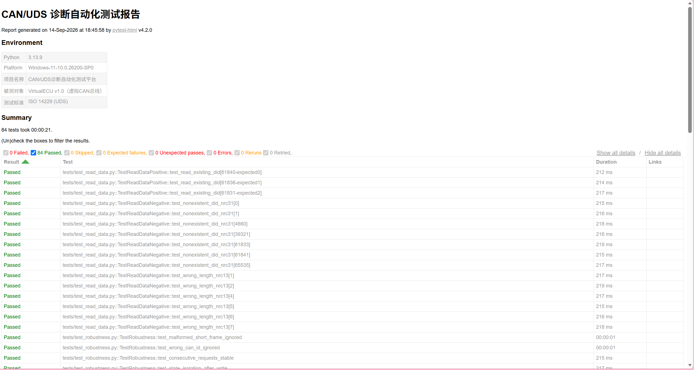
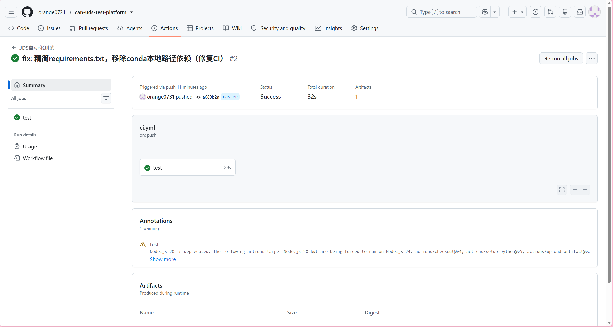
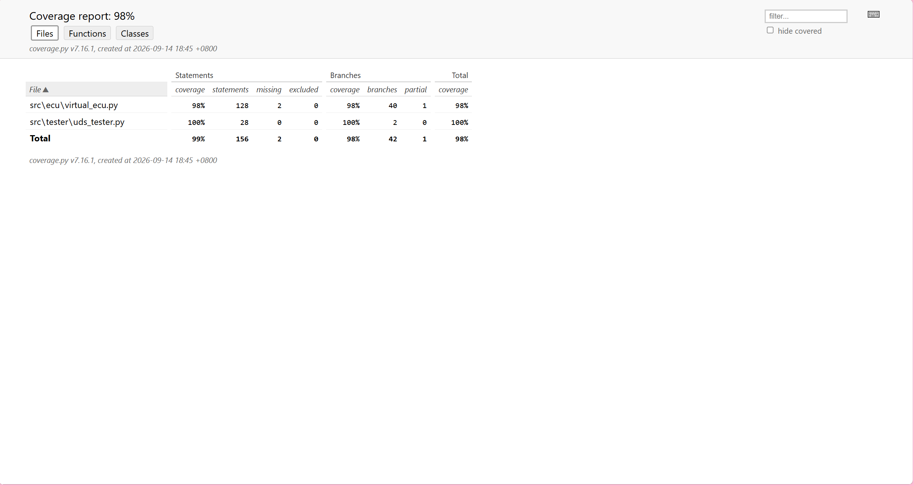

# CAN/UDS 诊断自动化测试平台


> 基于 python-can 虚拟 CAN 总线与 pytest 的汽车 UDS（ISO 14229）诊断自动化测试平台：
> 覆盖 4 个核心诊断服务、82 条自动化用例、90%+ 代码覆盖率，并集成 GitHub Actions CI/CD 实现每次提交自动回归。

## 📌 项目背景

UDS 诊断测试是汽车电子测试工程师的核心工作之一。传统诊断测试依赖 CANoe + 真实 ECU 硬件，
成本高昂且无法跑在云端 CI 中。本项目**在纯软件仿真环境**中构建了"虚拟 ECU（被测对象）+
诊断仪（测试引擎）+ pytest（自动化框架）"的完整测试体系，零硬件成本复现了真实诊断测试的核心流程。

## 🏗️ 系统架构

```mermaid
flowchart LR
    subgraph CI["GitHub Actions · 持续集成"]
        PUSH["git push / PR 触发"] --> MATRIX["Python 3.10 / 3.11 / 3.12 矩阵<br/>并行执行全量测试"]
        MATRIX --> ART["归档测试报告与覆盖率工件"]
    end

    subgraph TEST["测试层"]
        PT["pytest 用例集<br/>正向 · 负向 · 边界值 · 时序 · 健壮性"]
        FIX["conftest.py<br/>fixture：用例级 ECU 生命周期管理"]
        RPT["pytest-html / pytest-cov<br/>测试报告 · 覆盖率统计"]
    end

    subgraph ENG["测试引擎层"]
        UT["UdsTester 诊断仪<br/>请求 / 响应 / P2 计时"]
    end

    subgraph DUT["被测对象（DUT）"]
        ECU["VirtualECU<br/>UDS 四服务 + 状态机（会话 × 安全锁）"]
        DID[("DID 数据库<br/>VIN / 序列号 / 软件版本")]
        ECU --- DID
    end

    PT --> FIX --> UT
    PT --> RPT
    UT -- "CAN 0x7E0 诊断请求" --> ECU
    ECU -- "CAN 0x7E8 诊断响应" --> UT
    CI -. 本地与云端运行同一套测试 .-> TEST

## ✨ 核心功能

| 模块 | 说明 |
|------|------|
| **虚拟 ECU** | 支持 0x10 会话控制 / 0x22 读数据 / 0x27 安全访问（种子&密钥）/ 0x2E 写数据，含完整状态机（切回默认会话自动重置安全锁） |
| **测试引擎** | UdsTester 封装"请求-响应-P2 计时"；conftest fixture 保证用例间状态完全隔离 |
| **测试用例** | 82 条：正向 + 负向（NRC 0x11/0x12/0x13/0x31/0x33/0x35/0x7F）+ 边界值（密钥±1）+ 时序（P2）+ 健壮性（畸形帧/错误ID/连续压力） |
| **报告体系** | pytest-html 单文件中文报告 + pytest-cov 语句/分支覆盖率 |
| **CI/CD** | GitHub Actions：push 自动回归，失败时自动上传报告工件 |

## 📊 测试结果

- ✅ **82 条自动化用例全部通过**
- 📈 语句覆盖率 **__%**，分支覆盖率 **__%**
- 🔄 每次 push 云端自动回归

**HTML 测试报告：**



**CI 流水线（云端自动运行）：**



**代码覆盖率：**



## 🚀 快速上手

```bash
# 1. 克隆仓库
git clone https://github.com/orange0731/can-uds-test-platform.git
cd can-uds-test-platform

# 2. 安装依赖（建议 Python 3.10+，纯软件仿真，无需任何硬件）
pip install -r requirements.txt

# 3. 一键运行：82条测试 + HTML报告 + 覆盖率统计
python -m pytest

# 4. 查看报告
#    测试报告:  reports/uds_test_report.html
#    覆盖率报告: reports/coverage_html/index.html
```

## 📁 目录结构

```
├── src/
│   ├── ecu/virtual_ecu.py      # 虚拟ECU：UDS状态机 + SID分发 + 正负响应
│   └── tester/uds_tester.py    # 诊断仪封装：请求/响应/P2计时
├── tests/                      # 82条pytest用例（按服务分文件组织）
│   ├── conftest.py             # fixture：用例级ECU生命周期管理
│   ├── test_session_control.py # 0x10 会话控制
│   ├── test_read_data.py       # 0x22 读数据
│   ├── test_security_access.py # 0x27 安全访问
│   ├── test_write_data.py      # 0x2E 写数据
│   ├── test_unsupported_service.py  # 未支持服务负响应
│   ├── test_timing.py          # P2时序性能
│   └── test_robustness.py      # 健壮性（模糊测试雏形）
├── .github/workflows/ci.yml    # GitHub Actions CI配置
└── docs/                       # 协议笔记与每日开发日志
```

## 🛠️ 技术栈

**python-can**（CAN总线通信）· **pytest**（测试框架）· **pytest-html / pytest-cov**（报告与覆盖率）· **GitHub Actions**（CI/CD）· 协议标准：**ISO 14229 (UDS)**

## 📖 开发日志

项目按天迭代开发，完整日志见 [docs/](docs/) 目录（Day1-Day9）。