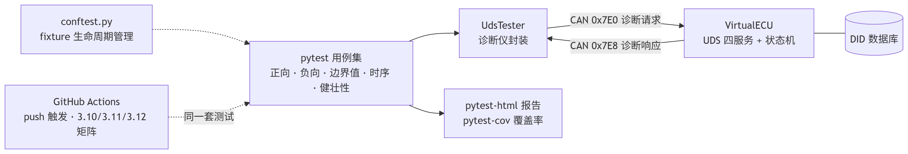
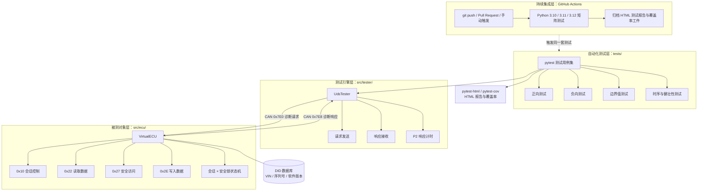

# CAN/UDS 诊断自动化测试平台  
## python-can · pytest · GitHub Actions · 虚拟 ECU

[](https://github.com/orange0731/can-uds-test-platform/actions/workflows/ci.yml)


> Hardware-free UDS diagnostic test platform based on a simulated CAN bus.  
> It provides a virtual ECU, automated diagnostic testing, coverage analysis,  
> HTML reporting and continuous integration without target hardware.

面向汽车电子诊断测试场景的宿主机自动化测试平台。项目基于 `python-can` 构建虚拟 CAN 通信环境，实现支持 UDS（ISO 14229）核心服务的虚拟 ECU，并使用 `pytest` 构建自动化测试体系，覆盖会话控制、数据读写、安全访问、异常响应、边界条件、响应时序与通信健壮性等测试场景。

项目全部运行于宿主机软件仿真环境，不依赖真实 ECU、CAN 接口卡或其他物理硬件。

当前共包含 **85 条自动化测试用例**，语句覆盖率与分支覆盖率均达到 **100%**，并通过 GitHub Actions 实现多 Python 版本矩阵下的持续集成验证。

---

## 目录

- [特性](#特性)
- [效果展示](#效果展示)
- [系统架构](#系统架构)
- [快速开始](#快速开始)
- [项目结构](#项目结构)
- [测试矩阵与覆盖率](#测试矩阵与覆盖率)
- [测试设计要点](#测试设计要点)
- [虚拟 ECU 与状态机设计](#虚拟-ecu-与状态机设计)
- [质量保障体系](#质量保障体系)
- [CI 持续集成](#ci-持续集成)
- [依赖管理](#依赖管理)
- [覆盖率缺口分析](#覆盖率缺口分析)
- [设计决策](#设计决策)
- [已知限制](#已知限制)
- [改进路线](#改进路线)
- [文档](#文档)
- [许可证](#许可证)

---

## 特性

- 85 条自动化测试用例，采用 `pytest fixture` 与 `parametrize` 构建，全部通过。
- 语句覆盖率 **100.0%**、分支覆盖率 **100.0%**，基于 `pytest-cov` 统计，并支持 ECU 子线程覆盖率追踪。
- 虚拟 ECU 支持以下四个核心 UDS 服务：
  - `0x10`：诊断会话控制（Diagnostic Session Control）
  - `0x22`：通过标识符读取数据（Read Data By Identifier）
  - `0x27`：安全访问（Security Access）
  - `0x2E`：通过标识符写入数据（Write Data By Identifier）
- 实现默认会话、扩展会话与安全访问状态机。
- 实现种子 / 密钥安全访问流程及未授权写入保护。
- 实现标准 UDS 正响应和负响应格式：`0x7F + SID + NRC`。
- 覆盖正常路径、异常路径、等价类、边界值、状态迁移和错误注入场景。
- 使用 `pytest-html` 生成可视化 HTML 测试报告。
- 使用 `pytest-cov` 统计语句覆盖率与分支覆盖率。
- GitHub Actions 支持 Python `3.10 / 3.11 / 3.12` 矩阵测试。
- 测试失败时自动归档 HTML 测试报告和覆盖率报告。
- 覆盖率缺口经过定位、补测和闭环验证。

---

## 效果展示

### 1. 系统架构

<p align="center">
  
</p>

> 图 1：CAN/UDS 诊断自动化测试平台系统架构。

---

### 2. pytest 测试全绿

<p align="center">
  
</p>

> 图 2：pytest 自动化测试执行结果，全部测试用例通过。

---

### 3. GitHub Actions CI

<p align="center">
  
</p>

> 图 3：GitHub Actions 在 Python 3.10、3.11 和 3.12 环境下的持续集成验证结果。

---

### 4. 代码覆盖率

<p align="center">
  
</p>

> 图 4：pytest-cov 生成的语句覆盖率与分支覆盖率报告。

## 系统架构



---

## 快速开始

### 环境要求

- Python `3.10` 或更高版本；
- Windows、Linux 或 macOS；
- 无需安装 CAN 硬件；
- 无需安装 CANoe 或真实 ECU；
- 项目使用 `python-can virtual` 总线进行软件仿真。

### 安装依赖

```bash
git clone https://github.com/orange0731/can-uds-test-platform.git
cd can-uds-test-platform
pip install -r requirements.txt
```

### 运行全部测试

```bash
python -m pytest
```

该命令将自动完成：

1. 执行全部 85 条自动化测试；
2. 生成 HTML 测试报告；
3. 统计语句覆盖率与分支覆盖率；
4. 生成覆盖率 HTML 页面。

### 查看测试报告

#### Windows PowerShell

```powershell
start reports\uds_test_report.html
start reports\coverage_html\index.html
```

#### Linux 或 macOS

```bash
open reports/uds_test_report.html
open reports/coverage_html/index.html
```

---

## 项目结构

```text
├── src/
│   ├── __init__.py
│   ├── ecu/
│   │   ├── __init__.py
│   │   └── virtual_ecu.py
│   │       # 虚拟 ECU：UDS 服务分发、状态机、正负响应
│   └── tester/
│       ├── __init__.py
│       └── uds_tester.py
│           # 诊断仪封装：请求、响应与 P2 计时
│
├── tests/
│   ├── __init__.py
│   ├── conftest.py
│   │   # pytest fixture：ECU 启动、诊断仪创建与资源释放
│   ├── test_session_control.py
│   │   # 0x10 会话控制测试
│   ├── test_read_data.py
│   │   # 0x22 读数据测试
│   ├── test_security_access.py
│   │   # 0x27 安全访问测试
│   ├── test_write_data.py
│   │   # 0x2E 写数据测试
│   ├── test_unsupported_service.py
│   │   # 未支持服务与 NRC 0x11 测试
│   ├── test_timing.py
│   │   # P2 响应时序测试
│   └── test_robustness.py
│       # 畸形报文、错误 CAN ID、连续请求与状态隔离测试
│
├── examples/
│   ├── __init__.py
│   ├── demo_can_basic.py
│   ├── demo_uds_echo.py
│   ├── manual_test_services.py
│   └── manual_test_state_machine.py
│       # 手动验证示例
│
├── docs/
│   ├── uds_notes.md
│   │   # UDS 协议要点
│   ├── test_design.md
│   │   # 测试设计说明书
│   └── images/
│       ├── architecture.png
│       ├── test_report.png
│       ├── ci_passed.png
│       └── coverage.png
│           # README 展示图片
│
├── reports/
│   ├── uds_test_report.html
│   └── coverage_html/
│       # 本地生成的测试与覆盖率报告
│
├── .github/
│   └── workflows/
│       └── ci.yml
│           # GitHub Actions 持续集成配置
│
├── pytest.ini
├── .coveragerc
├── requirements.txt
├── README.md
└── LICENSE
```

---

## 测试矩阵与覆盖率

> 数据来源：`pytest` 测试结果与 `pytest-cov` 覆盖率报告。

| 服务 / 类别 | 用例数量 | 覆盖重点 | 语句覆盖率 | 分支覆盖率 |
|---|---:|---|---:|---:|
| `0x10` 会话控制 | 13 | 默认会话、扩展会话、非法子功能、长度边界、回切默认会话自动重锁 | 100% | 100% |
| `0x22` 读数据 | 16 | 合法 DID、不存在 DID、DID 边界、请求长度异常 | 100% | 100% |
| `0x27` 安全访问 | 17 | 会话门槛、请求种子、正确密钥、错误密钥、种子和密钥长度异常 | 100% | 100% |
| `0x2E` 写数据 | 10 | 会话保护、安全保护、只读 DID、写后回读闭环 | 100% | 100% |
| 未支持服务 | 19 | 多个非法 SID 与 NRC `0x11` 负响应 | 100% | 100% |
| P2 时序测试 | 5 | 响应时间上限、完整解锁流程时序 | 100% | 100% |
| 健壮性测试 | 5 | 畸形帧、错误 CAN ID、连续请求、状态隔离 | 100% | 100% |
| **合计** | **85** | — | **100%** | **100%** |

---

## 测试设计要点

项目采用多种软件测试方法覆盖 UDS 服务及状态机行为：

- 使用**等价类划分**覆盖合法请求与非法请求；
- 使用**边界值分析**覆盖 DID、长度字段和密钥邻近值；
- 使用**状态迁移测试**覆盖默认会话、扩展会话、锁定和解锁状态；
- 使用**错误猜测法**覆盖畸形帧、错误 CAN ID 和连续请求；
- 使用**场景法**验证“切换会话 → 安全解锁 → 写入 → 回读 → 权限失效”的完整流程；
- 使用 **P2 时序测试**验证虚拟 ECU 是否在规定时间内响应；
- 所有负向用例均验证完整负响应格式，而不是只验证单个字节；
- 所有写操作均通过回读验证数据是否真正生效；
- 使用独立 ECU 实例确保不同测试用例之间不会发生状态污染。

---

## 虚拟 ECU 与状态机设计

虚拟 ECU 是项目中的被测对象（DUT）。其通过 SID 服务分发表将不同 UDS 服务映射到对应处理函数：

```python
self.service_handlers = {
    0x10: self._handle_session_control,
    0x22: self._handle_read_data_by_identifier,
    0x27: self._handle_security_access,
    0x2E: self._handle_write_data_by_identifier,
}
```

### 会话与安全状态转换

```text
默认会话
    │
    │ 0x10 03
    ▼
扩展会话 / 安全锁定
    │
    │ 0x27 请求种子 + 发送正确密钥
    ▼
扩展会话 / 安全解锁
    │
    │ 0x10 01
    ▼
默认会话 / 安全锁定
```

### 状态机测试规则

| 当前状态 | 操作 | 预期结果 |
|---|---|---|
| 默认会话 | 读取 DID | 返回正响应 |
| 默认会话 | 写入 DID | 返回 NRC `0x7F` |
| 扩展会话、未解锁 | 写入 DID | 返回 NRC `0x33` |
| 扩展会话、错误密钥 | 发送密钥 | 返回 NRC `0x35` |
| 扩展会话、已解锁 | 写入可写 DID | 返回正响应 |
| 扩展会话、已解锁 | 写入只读 DID | 返回 NRC `0x31` |
| 任意会话 | 切回默认会话 | 安全锁自动重置 |

---

## UDS 正响应与负响应规则

### 正响应规则

UDS 正响应服务 ID 等于请求服务 ID 加上 `0x40`：

```text
请求：22 F1 90
响应：62 F1 90 ...
```

### 负响应规则

UDS 负响应格式如下：

```text
7F <原始 SID> <NRC>
```

示例：

```text
请求：2E F1 90 ...
响应：7F 2E 33
```

表示执行 `0x2E` 写数据服务时，由于安全访问未完成而返回 NRC `0x33`。

### 项目覆盖的 NRC

| NRC | 含义 | 测试场景 |
|---:|---|---|
| `0x11` | 服务不支持 | 请求未实现的 SID |
| `0x12` | 子功能不支持 | 请求非法会话或安全子功能 |
| `0x13` | 报文长度错误 | 请求长度不符合服务要求 |
| `0x31` | 请求超出范围 | DID 不存在或 DID 只读 |
| `0x33` | 安全访问被拒绝 | 未解锁执行写操作 |
| `0x35` | 密钥错误 | 发送错误安全密钥 |
| `0x7F` | 当前会话不支持 | 默认会话下执行受保护服务 |

> **简化声明：** 当前项目使用经典 CAN 单帧数据模型验证 UDS 服务语义。  
> 对于超过单帧容量的长数据，例如完整 17 字节 VIN，需要在后续版本中引入 ISO-TP 多帧传输。

---

## 质量保障体系

### 测试隔离

每一个测试用例均通过 `pytest fixture` 创建独立的：

- `VirtualECU` 实例；
- ECU 后台监听线程；
- 诊断仪总线对象；
- DID 初始数据状态。

测试结束后自动执行：

```text
停止 ECU 主循环
    ↓
等待线程退出
    ↓
关闭 ECU 总线
    ↓
关闭诊断仪总线
```

该机制避免了测试用例之间的会话状态、安全状态和 DID 数据相互污染。

### 参数化测试

使用 `pytest.mark.parametrize` 批量覆盖服务输入空间：

```python
@pytest.mark.parametrize(
    "wrong_key",
    [0x0000, 0x0001, 0x5A48, 0x5A4A, 0xFFFF],
)
def test_wrong_key_nrc35(ecu_and_tester, wrong_key):
    ...
```

参数化测试用于扩展以下场景：

- 多个 DID；
- 多个非法 SID；
- 多种非法子功能；
- 不同长度字段；
- 正确密钥邻近值；
- 多组错误输入和边界输入。

### 覆盖率质量门禁

覆盖率通过 `pytest-cov` 统计，并在 `.coveragerc` 中启用子线程追踪：

```ini
[run]
source = src
concurrency = thread
branch = true
```

当前覆盖率结果：

```text
语句覆盖率：100%
分支覆盖率：100%
函数覆盖率：100%
```

覆盖率报告中发现的未覆盖分支经过专项补测后全部闭环，最终达到 100% 覆盖率。

---

## CI 持续集成

GitHub Actions 在以下条件下自动触发：

- `push` 到 `master` 或 `main` 分支；
- 创建或更新 Pull Request；
- 手动触发 `workflow_dispatch`。

CI 流程如下：

```text
检出代码
    ↓
创建 Python 3.10 / 3.11 / 3.12 矩阵环境
    ↓
安装 requirements.txt 中的项目依赖
    ↓
执行完整 pytest 测试套件
    ↓
生成 HTML 测试报告与覆盖率报告
    ↓
上传测试报告和覆盖率报告工件
```

即使测试失败，CI 仍然会通过 `if: always()` 上传报告，便于定位失败原因。

---

## 依赖管理

项目不直接使用完整开发环境的 `pip freeze` 结果，而是维护最小化项目依赖：

```text
python-can
cantools
pytest
pytest-html
pytest-cov
```

这样可以避免将 Conda 本地路径、系统专用包和无关依赖带入 CI 环境。

---

## 覆盖率缺口分析

当前版本的语句覆盖率与分支覆盖率均达到 100%，不存在未覆盖代码分支。

覆盖率闭环过程如下：

```text
执行覆盖率统计
    ↓
定位 virtual_ecu.py 中未覆盖的种子长度校验分支
    ↓
设计“请求种子时长度错误”的负向测试
    ↓
验证 NRC 0x13
    ↓
重新执行覆盖率统计
    ↓
语句与分支覆盖率均达到 100%
```

> 覆盖率应被视为测试充分性的度量，而不是不存在缺陷的证明。

当前项目仍明确记录了以下未纳入测试范围的内容：

- ISO-TP 多帧传输；
- CAN 总线电气层异常；
- Bus-off、ACK 错误和位错误；
- 真实 ECU 的 Flash、NVM 或 EEPROM 行为；
- 真实 CAN 接口卡与实体 ECU 的通信一致性。

---

## 设计决策

| 决策 | 理由 |
|---|---|
| 使用 `python-can virtual` 总线 | 无需硬件即可复现节点间 CAN 通信，且可直接运行于 GitHub Actions |
| 使用 `pytest` 而非 `unittest` | fixture、parametrize 和插件生态更适合构建自动化测试体系 |
| 使用字典式 SID 分发 | 新增服务时只需注册处理函数，符合开闭原则 |
| 使用固定种子 | 保证自动化测试可重复；真实 ECU 应使用随机种子防止重放攻击 |
| 每个用例创建全新 ECU | 保证会话、安全状态和 DID 数据相互隔离 |
| 写入后回读 | 验证写操作真正修改了 ECU 状态，避免只验证正响应 |
| `logging` 替代 `print` | 支持日志级别控制，避免测试运行时输出过多调试信息 |
| 使用单帧模型 | 当前阶段聚焦 UDS 服务语义，多帧传输列入后续规划 |
| 将测试报告作为 CI 工件 | 测试失败时仍可以下载报告进行问题定位 |
| 手写最小依赖清单 | 避免 Conda 本地路径依赖导致 CI 安装失败 |

---

## 已知限制

- 当前 CAN 数据模型主要面向经典 CAN 单帧场景；
- 尚未实现 ISO-TP 多帧传输；
- 虚拟 CAN 总线不模拟 Bus-off、位错误、ACK 错误和波特率不匹配；
- 当前安全访问算法为教学用途，不代表真实 ECU 的安全算法；
- 当前项目未接入真实 CAN 接口卡或实体 ECU；
- P2 响应时间测试基于软件仿真环境，不等同于真实 ECU 的实时性测试；
- 当前 DID 数据库为内存模型，未模拟真实 NVM、Flash 或 EEPROM 行为；
- 当前未实现 DBC 信号级编码与解码测试；
- 当前未覆盖多诊断仪并发访问与长时间稳定性测试。

---

## 改进路线

### 已完成

- [x] 实现 UDS `0x10` 会话控制；
- [x] 实现 UDS `0x22` 读数据服务；
- [x] 实现 UDS `0x27` 安全访问；
- [x] 实现 UDS `0x2E` 写数据服务；
- [x] 构建 pytest fixture 与参数化测试体系；
- [x] 集成 pytest-html 测试报告；
- [x] 集成 pytest-cov 覆盖率统计；
- [x] 实现覆盖率缺口定位与补测闭环；
- [x] 接入 GitHub Actions 三版本矩阵 CI；
- [x] 建立测试状态隔离与资源自动释放机制。

### 后续计划

- [ ] 引入 `can-isotp` 实现 ISO-TP 多帧传输；
- [ ] 支持 17 字节完整 VIN 的多帧读写；
- [ ] 基于 `cantools` 增加 DBC 信号级测试；
- [ ] 增加 CAN Bus-off 与通信故障注入；
- [ ] 增加随机种子与防重放攻击测试；
- [ ] 接入真实 CAN 接口进行虚实对比验证；
- [ ] 增加协议模糊测试与输入变异测试；
- [ ] 增加静态分析和安全编码检查；
- [ ] 增加性能基线、并发访问和长时间稳定性测试；
- [ ] 引入更完整的 ISO 14229 服务覆盖；
- [ ] 增加真实 ECU 或 CANoe/CANalyzer 兼容性验证。

---

## 文档

- [UDS 协议要点](docs/uds_notes.md)
- [测试设计说明书](docs/test_design.md)
- [阶段制开发记录](docs/development_log.md)

---

## 许可证

本项目基于 [MIT License](LICENSE) 开源，详见 [LICENSE](LICENSE) 文件。

---

<p align="center">
  <b>CAN/UDS Diagnostic Automation Test Platform</b><br/>
  Hardware-Free · Automated Testing · Coverage Analysis · Continuous Integration
</p>